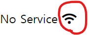

# 3월 10일 ~ 14일 HTML/CSS/JS

#### index_html

- 첫 번째 페이지는 **index.html**
  - 대부분의 웹 서버는 디폴트로 index.html을 먼저 보여줌

#### 단축키

1. html 파일 처음 생성할 때 **첫 줄에 ! 치고 엔터**만 누르면 모든 html, head, body 설정을 알아서 해줌
2. div class="name"은 **div.name** 하면 자동완성
3. div id="id"는 **div#id**하면 자동완성
4. 한 줄 작성후 **ctrl + /** 하면 자동 주석처리
5. **요소1>요소2>요소3** =>
   > <요소1>  
   >  ..<요소2>  
   >  ....<요소3></요소3>  
   >  ..</요소2>  
   >  <요소1>
6. **요소1\*4** =>
   > <요소1></요소1>  
   > <요소1></요소1>  
   > <요소1></요소1>  
   > <요소1></요소1>

#### 클래스명 규칙 (BEM)

- **Block\_\_Element--Modifier** 규칙
- CSS나 html을 쓸 때 클래스명이나 id 등의 요소명을 다른 사람이 보더라도 알아보기 쉽게 해주는 Convention
- 부모요소명\_\_요소종류--속성
  - 예시: btn btn--big btn--orange (자식요소: btn\_\_price, btn\_\_text)
  - **btn--big**은 css상에서 버튼 크기를 크게 만들어줌
  - **btn--orange**는 css상에서 버튼색을 오렌지색으로 만들어줌
  - **btn\_\_price**는 btn의 자식요소 중 price 내용을 담았음을 알 수 있음
  - **btn\_\_text**는 btn의 자식요소 중 text를 담고 있음을 알 수 있음
- 이런 식으로 이름을 지어주면 굳이 html과 css 사이를 왔다갔다할 필요 없이 직관적으로 요소를 이해할 수 있음
- 길이가 너무 길어진다고 찝찝해하지 말자 (직관성이 중요하기 때문에 BEM 따르는 것을 추천!)

#### Font Awesome

- **svg**: 이미지형식이 아니라 좌표형식이라 이미지를 늘리건 줄이건 화질이 깨지지 않는다
- [HeroIcons](https://heroicons.dev/)는 아이콘 이미지를 많이 담고 있다
  - 들어가서 원하는 아이콘 선택하면 svg 좌표값들이 복사되므로, 붙여넣기하면 svg 태그로 사용가능하다
- [FontAwesome](https://fontawesome.com/) 또한 온갖 아이콘들을 다 갖고 있음 (무료로 사용가능한 아이콘과 유료 아이콘이 따로 있음)
  
  - 마찬가지로 들어가서 원하는 아이콘 선택 후 코드 복사하여 원하는 위치에 붙여넣으면 이미지가 나온다 (불러온 모습)
  - 태그의 i는 icon의 i임

#### Font

- **font-family** 속성은 폰트 뭉탱이
  - 폰트명1, 폰트명2, 폰트명3, ... , 폰트명n; 이라는 구성
  - 만약 폰트명1이 시스템에 없을 경우 폰트명2를 적용, 폰트명2도 없으면 폰트명3을 적용... 함
- 폰트 구할 때 : [Google Fonts](https://fonts.google.com/)
  - select this style -> **<link\>** 소스를 긁어서 html에 추가하거나, **@import** 소스를 긁어서 css에 추가할 수 있음 (css로 추가하는 것을 추천)
  - 그리고 하단의 **CSS rules to specify families** 부분 font-family 코드를 복사하여 font-family 속성을 부여하면 됨
  - 여러 옵션을 선택할 수 있는데 (light, bold 등..) 많이 선택할수록 불러올 때 오래걸릴 수 있음

#### CSS hack

- 컨테이너 하나를 박스 중심에 넣는 기술
  - justify-content의 space-between은 같은 박스 안에 들어있는 다른 요소들의 너비가 서로 다를 때 요소가 정확하게 중앙에 오지 못한다
- 정석적인 방법이 아니라 의아할 수 있지만 작동이 되는 약간 지름길같은 방식

1. 부모 요소의 속성을 **justify-content: center**로 지정
2. 모든 자식 요소에게 width: 33% 속성 부여
3. 중앙에 두고 싶은 요소 (예시에서는 2번째 자식 요소) 의 **display: flex로, justify-content: center**로 지정
4. 해당 요소 뒤에 있는 요소들 (예시에서는 3번째 자식 요소) 의 **display: flex로, justify-content: flex-end** 로 지정
5. 마지막 요소의 아이콘을 재정렬하기 위해 **align-items: center** 설정
6. 마지막 요소의 아이콘 사이에 공간을 주기 위해 아이콘들을 선택 후 (class 두개 한번에 고르면 됨: **.div클래스명 .아이콘클래스명**) margin: 5px 설정

- fontawesome 아이콘 크기 크게 하는 방법
  - i class="" 에 **fa-2x** 같은 특정한 태그 추가 (사이트 참고)

#### Reset CSS

- 간혹 우리가 원치 않는 css 초기설정들 (margin, padding 등) 을 브라우저가 임의로 부여하는 경우가 있음
  - 이것을 없애기 위해 사용하는 것이 reset.css
- css 형식 파일인데, 모든 초기설정을 0으로 돌려줌
- 파일을 받아서 같은 폴더에 넣어놓고 css 파일에서 불러오면 됨 **(@import)**
  - 글씨크기, margin, 줄옮김 등의 모든 기본 설정이 무로 돌아간다
  - 이걸 이용해서 0부터 다시 시작하는 것이 좋을 수도 있음

#### not

- 요소들 중 특정 요소에 속성이 적용되는 것이 싫을 때 사용
- body :not(a) 는 a (anchor) 요소들을 제외하고 속성을 적용하라는 뜻

#### inherit

- 부모 요소로부터 속성을 물려받는 것

#### form Post, Get

- form method="" 에 들어가는 요소들
- **post**는 백엔드 서버에 정보를 보내는 것
- **get**은 URL에 값을 넣어서 다른 페이지에 넘기는 것 (보안에 아주 취약)
- 보통 중요한 값은 서버에 넘기기 위해 post를 쓰고, 페이지 이동만 할 거면 get 사용 (예시: 구글 검색 등)

#### navigation (nav)

- 안에 list를 담으며, 다른 곳으로 넘어갈 수 있는 링크들이 list 형식으로 저장되어 있음

#### box-sizing: border-box

- 박스 크기를 잴 때 테두리의 두께를 포함해서 크기를 지정
- 기존에 width와 height를 주면 테두리 내부의 요소에만 크기를 할당하기 때문에 테두리를 넣으면 크기가 더 늘어났음
- 해당 속성을 사용하면 width가 100px이고 테두리가 5px일 때 실질적인 내부 박스 width는 90px이 됨 (좌우 5px씩 10px 제외)

#### position:absolute

- position:fixed처럼 다른 요소들의 위로 올라간다 (z축으로 레이어 한칸 올라감)
- 같은 부모 요소를 둔 형제요소에 같이 absolute 속성을 부여하면 같은 레이어에 위치함

#### flex - order

- display: flex가 적용된 요소의 자식 요소만 적용할 수 있는 속성
- 요소들의 순서를 바꾼다 (작을 수록 앞에 옴)
- 순서를 맞바꿀 요소들의 부모 요소 속성에 flex-direction: row-reverse를 주면 전체 순서가 거꾸로 바뀜
